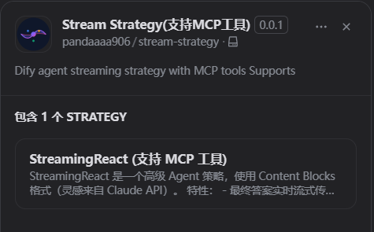
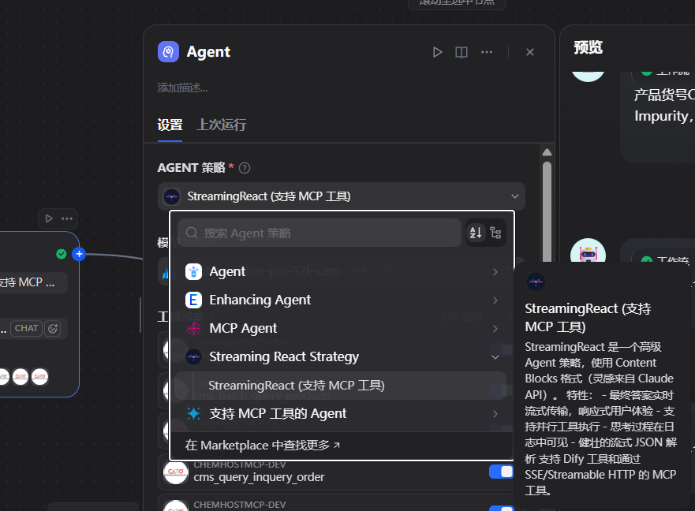

## Dify agent plugin: Streaming Strategy

**Author:** [pandaaaa906](https://github.com/Pandaaaa906)   
**Type:** agent-strategy   
**Github Repo:** [https://github.com/Pandaaaa906/dify-plugin-agent-stream-strategy](https://github.com/Pandaaaa906/dify-plugin-agent-stream-strategy)   
**Github Issues:** [issues](https://github.com/Pandaaaa906/dify-plugin-agent-stream-strategy/issue)


### Thanks(特别鸣谢)
[junjiem/dify-plugin-agent-mcp_sse](https://github.com/junjiem/dify-plugin-agent-mcp_sse/)


### Description
支持流式返回，支持Dify原生MCP工具，以及自定义MCP服务




Custom MCP Servers config, support multiple MCP services. The following example:

自定义MCP服务配置，支持多个MCP服务。 如下示例：

> **Note:** "transport" parameter as `sse` or `streamable_http`, default `sse`.

> **注：**  "transport" 参数为 `sse` 或 `streamable_http` ，默认为 `sse`。

```json
{
  "server_name1": {
    "transport": "sse",
    "url": "http://127.0.0.1:8000/sse",
    "headers": {},
    "timeout": 50,
    "sse_read_timeout": 50
  },
  "server_name2": {
    "transport": "sse",
    "url": "http://127.0.0.1:8001/sse"
  },
  "server_name3": {
    "transport": "streamable_http",
    "url": "http://127.0.0.1:8002/mcp",
    "headers": {},
    "timeout": 50
  },
  "server_name4": {
    "transport": "streamable_http",
    "url": "http://127.0.0.1:8003/mcp"
  }
}
```


---


### FAQ

#### 1. How to Handle Errors When Installing Plugins? 安装插件时遇到异常应如何处理？

**Issue**: If you encounter the error message: plugin verification has been enabled, and the plugin you want to install has a bad signature, how to handle the issue?

**Solution**: Add the following line to the end of your .env configuration file: `FORCE_VERIFYING_SIGNATURE=false`
Once this field is added, the Dify platform will allow the installation of all plugins that are not listed (and thus not verified) in the Dify Marketplace.

**问题描述**：安装插件时遇到异常信息：plugin verification has been enabled, and the plugin you want to install has a bad signature，应该如何处理？

**解决办法**：在 .env 配置文件的末尾添加 `FORCE_VERIFYING_SIGNATURE=false` 字段即可解决该问题。
添加该字段后，Dify 平台将允许安装所有未在 Dify Marketplace 上架（审核）的插件，可能存在安全隐患。


#### 2. How to install the offline version 如何安装离线版本

Scripting tool for downloading Dify plugin package from Dify Marketplace and Github and repackaging [true] offline package (contains dependencies, no need to be connected to the Internet).

从Dify市场和Github下载Dify插件包并重新打【真】离线包（包含依赖，不需要再联网）的脚本工具。

Github Repo: https://github.com/junjiem/dify-plugin-repackaging